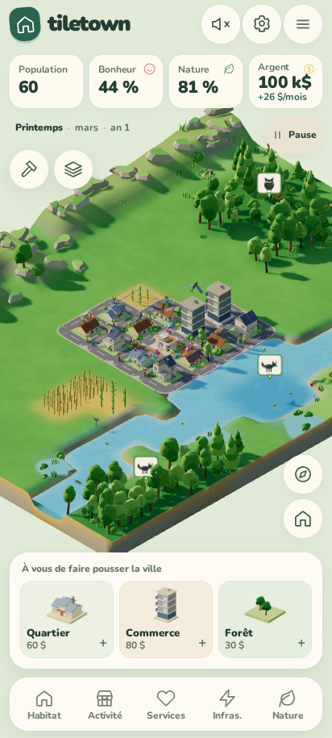

# Tiletown

City builder cosy en tuiles, en 3D basse définition au rendu lisse, dans le navigateur et d'abord sur téléphone.

Construis la ville la plus prospère possible sans sacrifier la vallée qui l'accueille : l'air, l'eau et la faune comptent autant que l'argent et la population. Chaque tuile est un îlot avec une spécialité ou un morceau de nature ; les rues se tracent toutes seules entre les îlots.

- Conception du jeu : [`docs/GAME_DESIGN.md`](docs/GAME_DESIGN.md)
- Version téléphone : [`docs/MOBILE.md`](docs/MOBILE.md)
- Ressources et licences : [`docs/ASSETS.md`](docs/ASSETS.md)
- Journal : [`JOURNAL.md`](JOURNAL.md)

Toutes les ressources sont libres (CC0, CC BY, OFL, MIT, ISC) et listées dans `CREDITS.md` ; le jeu construit est publié sur GitHub Pages. Voir `docs/ASSETS.md` pour l'étude des ressources.

Projet frère de [Une année à la ferme](https://github.com/Madec01/Seve).

## Une ville qui respire — nouvelle expérience mobile



Un paysage 3D continu, des arbres arrondis, un catalogue illustré et trois musiques libres. La carrière commence avec la mairie seule et propose cinq vallées, chacune sur trois années de jeu, avec dix leçons de tutoriel, huit missions à primes, des objectifs propres et des étoiles persistantes. Le mode libre démarre avec un village, tout le catalogue et 100 000 $. Les anciennes sauvegardes restent compatibles.

La capture montre le mode libre.

### Développement et validation

```sh
npm ci
npm run build
python3 -m http.server 8000
# Dans un autre terminal :
npm test
npm run check
npm run review:mobile
```

Ouvrir `http://localhost:8000`. Les tests de navigateur et les rendus d’aperçus demandent Chromium (`npx playwright install chromium`). `npm run render-previews` régénère les 22 miniatures à partir des modèles GLB. Les captures du parcours sont écrites dans `artifacts/review/`.

Les musiques et leurs licences sont détaillées dans [`assets/audio/SOURCES.md`](assets/audio/SOURCES.md). Elles sont mises en cache à la première écoute pour rester disponibles hors ligne.
